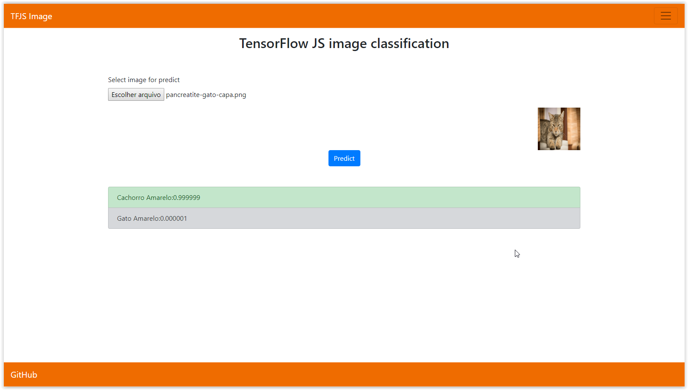

<p align="center"><a href="#" target="_blank" rel="noopener noreferrer"></a></p>

<p align="center">

</p>

<h2 align="center">TFJS Image</h2>

Image recognition with tensorflowJS and NodeJS.

Install dependencies and run.

```sh

$ npm install
$ npm start bin/www

```

Them access http://localhost:8080/predict

</a>